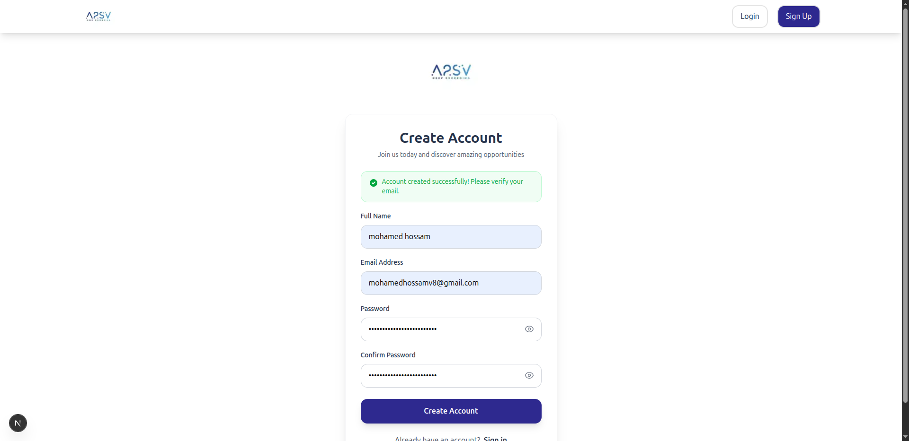

# 📝 Job Listing Application





## 🧬 How to Run the Project

1.  **Download or clone** this repository.

    ```bash
    git clone https://github.com/mohamed-hossam1/Job-Listing-Application.git
    ```

2.  ```bash
       cd Job-Listing-Application
       npm install
    ```

3.  ```bash
    npm run dev
    ```


3. Start 🌟

---

## 🧠 Technologies Used

* **HTML5**
* **CSS3** 
* **Next JS** 
* **type script** 
* **axios** 

